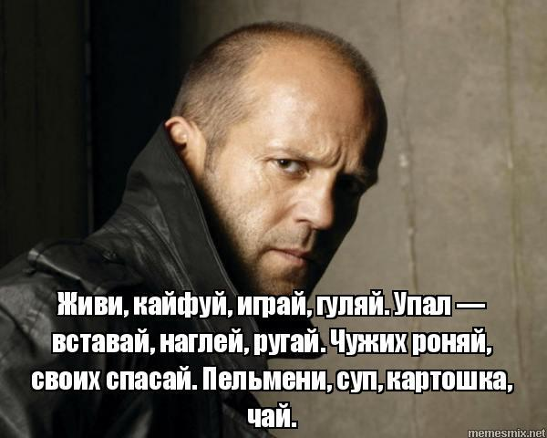

# Лабораторная работа №1

ФИО: Коршиков Егор Андреевич
Группа: 6402-010302D
Руководитель: Савельев Дмитрий Андреевич
Тема: Исследование методов асимметричного поиска информации с применением языковых моделей

Сдаются только слабаки. И анализы (с) Джейсон Стетхем

